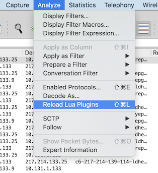

# wiresharkLUA

This is an example of a LUA plugin for Wireshark which goes through the packets and generates a statistic.

In my case, I was looking for Diameter Charging-Control stats around Reporting-Reason Valdity-Time.

## Pre-requisites

* Wireshark
* LUA environment

I've tested it on MacOS, same should work in Linux without modifications. I'm not sure about Windows - I will appreciate you comments.


## How to start

The plugin can be started in two ways:

### Command-line

Update `start.sh` to provide:

* path to your Wireshark application
* name to your pcap / snoop file

```
TSHARK='/Users/jhartman/Tools/Internet/Wireshark/Wireshark.app/Contents/MacOS/tshark'
INPUT='/Users/jhartman/Documents/Documents/Oracle/Telia/!Local/Logs and config/Diameter/!Production/spikes - 2020-02-03/dgw-spikes-tr001prdgw11.snoop'
```

Then you can invoke `start.sh` and see the result:

```
MBP:wiresharkLUA jhartman$ ./start.sh
Starting in command-line mode
Registering Listener
QUOTA_EXHAUSTED (3)            - 359 		(7.701 %)
FINAL (2)                      - 402 		(8.623 %)
VALIDITY_TIME (4)              - 3634 		(77.949 %)
QHT (1)                        - 267 		(5.727 %)

Total                          - 4662 		(100 %)

USU (octets) when VALIDITY_TIME (4)
Median  : 292458 octets, 285.60 kB
Average : 19140604 octets, 18692.00 kB
Min     : 112 octets
Max     : 310552054 octets, 303273.49 kB

Histogram of USU (Validity-Time)
 1:         0 MB -        11 MB :   2691 (74.05 %)
 2:        11 MB -        23 MB :    306 (8.42 %)
 3:        23 MB -        35 MB :    131 (3.60 %)
 4:        35 MB -        47 MB :     84 (2.31 %)
 5:        47 MB -        59 MB :     61 (1.68 %)
 6:        59 MB -        71 MB :     60 (1.65 %)
 7:        71 MB -        82 MB :     43 (1.18 %)
 8:        82 MB -        94 MB :     41 (1.13 %)
 9:        94 MB -       106 MB :     26 (0.72 %)
10:       106 MB -       118 MB :     24 (0.66 %)
11:       118 MB -       130 MB :     21 (0.58 %)
12:       130 MB -       142 MB :     15 (0.41 %)
13:       142 MB -       154 MB :     13 (0.36 %)
14:       154 MB -       165 MB :     16 (0.44 %)
15:       165 MB -       177 MB :     12 (0.33 %)
16:       177 MB -       189 MB :     11 (0.30 %)
17:       189 MB -       201 MB :     15 (0.41 %)
18:       201 MB -       213 MB :     10 (0.28 %)
19:       213 MB -       225 MB :      7 (0.19 %)
20:       225 MB -       236 MB :     10 (0.28 %)
21:       236 MB -       248 MB :      6 (0.17 %)
22:       248 MB -       260 MB :      9 (0.25 %)
23:       260 MB -       272 MB :      9 (0.25 %)
24:       272 MB -       284 MB :      8 (0.22 %)
25:       284 MB -       296 MB :      5 (0.14 %)
QUOTA_EXHAUSTED (3)            - 359 		(7.701 %)
FINAL (2)                      - 402 		(8.623 %)
VALIDITY_TIME (4)              - 3634 		(77.949 %)
QHT (1)                        - 267 		(5.727 %)

Total                          - 4662 		(100 %)
```

**Note** If you can see two invocations of LUA plugin, see the note in *Wireshark GUI* section:

```
Starting in command-line mode
Registering Listener
Starting in command-line mode
Registering Listener
```

### Wireshark GUI

In order to invoke the plugin from the GUI, you need to install it (i.e. upload) into relevant folder which is ' (see [Wireshark Plugin folders](https://www.wireshark.org/docs/wsug_html_chunked/ChPluginFolders.html)).

As I'm working with GitHub, I prefer to make a sym-link:

```
MBP:wiresharkLUA jhartman$ cd ../wiresharkLUA
MBP:wiresharkLUA jhartman$ ln -s $(pwd)/reportingReason-gui.lua ~/.local/lib/wireshark/plugins/reportingReason-gui.lua
```

After making the link, you need to reload the plugins by selecting *Analyse -> Reload LUA plugins*



Then you can open a Diameter Charging-Control log (i.e. one defined as per RFC 4006 or a relevant 3GPP spec) and start the analyze:


After a while, a window with statistics results will pop up:


### Wireshark LUA script starts twice when invoked from commandline

You may see that the script is invoked twice when starting from commandline:

```
MBP:wiresharkLUA jhartman$ ./start.sh
Starting in command-line mode
Registering Listener
Starting in command-line mode
Registering Listener
...
...
```

Reason for this the way how `tshark` loads the plugins:
* first time it loads all user plugins from  `~/.local/lib/wireshark/plugins/`
* and then it loads and executes all plugins defined through `-X`, i.e. `-X lua_script:reportingReason-gui.lua`

Solution: remove the plugin from the user plugins:

```
MBP:wiresharkLUA jhartman$ rm ~/.local/lib/wireshark/plugins/reportingReason-gui.lua
```


